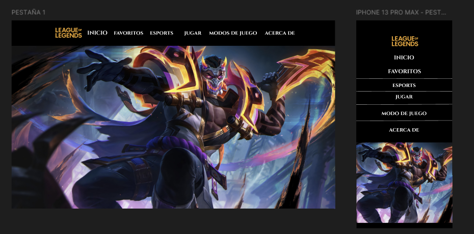

# League Of Legends API

Este proyecto es una recreación conceptual y educativa del popular videojuego **League of Legends**, implementando características, campeones y contenido visual. El objetivo es ofrecer una experiencia renovada, manteniendo la esencia estratégica y competitiva del juego original, pero con innovaciones propias.


## Maquetación en Figma



Se realizó la maquetación del proyecto con la herramienta figma, donde ahí se plasmó los diseños compleots y funcionales que están y ejecutados en el proyecto final.

A continuación el link de figma y su maquetación completa:

[Link de Figma](https://www.figma.com/design/6gxoWfMAbL0x4BzJwSMrRL/Untitled?node-id=0-1&p=f&t=Cu5I8SRXwTubul3D-0)

## Características principales

- **Campeones y habilidades**: Se muestran campeones originales con habilidades únicas, equilibradas y pensadas para aportar variedad táctica.
- **Interfaz de usuario intuitiva**: Menús y paneles de información rediseñados para facilitar la navegación y el acceso a datos relevantes.
- **Perfiles y campeones**: Campeones e iconos.
- **Elo y competitivos**: Muestra las diferentes clasifiaciones y elos disponibles en League of Legends, y así mismo al dificultad de ascender

## 📁 Estructura del Proyecto

HTML/
├── campeones/
├──como-jguar/
├──elos-lol/
├──modos-juego/
ICONS/
JAVASCRIPT/
├── main.js/
├── elos.js/
MULTIMEDIA/
data.json
index.html
ReadMe.md  
styles.css   

## Instalación

1. Clona el repositorio:
    ```bash
    git clone https://github.com/tu-usuario/League-Of-Legends-2.git
    ```
2. Accede al directorio del proyecto:
    ```bash
    cd League-Of-Legends-2
    ```
3. Instala las dependencias necesarias según la tecnología utilizada (ver sección _Tecnologías_).
4. Configura las variables de entorno si es necesario (ver archivo `.env.example`).
5. Sigue las instrucciones específicas de instalación y ejecución según la plataforma (ver sección _Uso_).


## Tecnologías
- **Lenguaje principal**: JavaScript
- **Estilos**: CSS
- **Estructura**: HTML


## Contribución

¡Las contribuciones son bienvenidas! Para colaborar:

1. Haz un fork del repositorio.
2. Crea una rama para tu feature o fix (`git checkout -b feature/nueva-funcionalidad`).
3. Realiza tus cambios y haz commit con mensajes descriptivos.
4. Asegúrate de que tu código pase las pruebas y sigue las guías de estilo del proyecto.
5. Envía un pull request detallando los cambios realizados.


## Créditos

Inspirado en **League of Legends** de Riot Games. Este proyecto es únicamente con fines educativos y de aprendizaje, y no está afiliado ni respaldado por Riot Games. Todos los nombres, marcas y recursos originales pertenecen a sus respectivos propietarios.

Agradecimientos a la comunidad open source y a los colaboradores que han aportado ideas, código y feedback para mejorar este proyecto.

## 📝 Notas

- Este proyecto tiene como único propósito servir para fines educativos y de aprendizaje.

---

## 👨‍💻 Autor

- **Jeferson Lopez** - [@jefersonperez](https://github.com/Jefersonlopezr)

## Recursos adicionales

- [Documentación oficial de API LOL](https://developer.riotgames.com/docs/lol)
